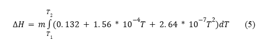
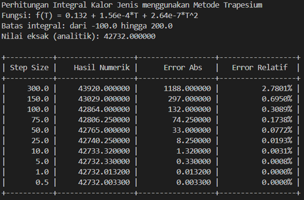
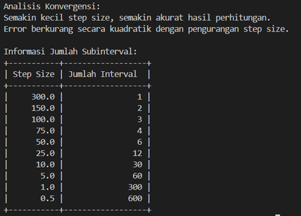
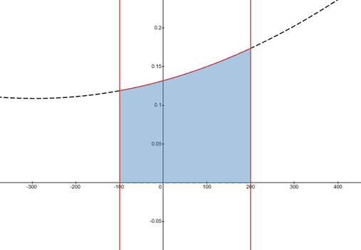

# Penggunaan Metode Numerik Trapezodial Rule untuk Menentukan Kuantitas Panas Total

## Author
Anthonius Hendhy Wirawan (2306161795)

## Penjelasan singkat
Program ini merupakan program yang dibuat untuk memperkirakan jumlah kalor yang dibutuhkan untuk meningkatkan suhu suatu material sebesar 1 derajat celcius dengan menggunakan metode komputasi numerik trapezodial rule.   

pada perhitungan ini, kita memperkirakan sebuah fungsi T yang menggambarkan jumlah kalor yang dibutuhkan untuk meningkatkan suhu sebesar 1 derajat celcius yaitu sebesar 
  

dari fungsi tersebut, kita memisalkan m (massa dari material) bernilai 1000 gram, sedangkan T1 (suhu awal) sebesar -100 derajat celcius, dan T2 (suhu akhir) adalah 200 derajat celcius.

dengan data dan fungsi tersebut, kita menggunakan trapezodial rule untuk meng-aproksimasikan nilai tersebut dengan nilai step size yang bervariasi, lalu menampilkan hasil, error absolute, error relative, serta jumlah interval (sama dengan jumlah iterasi) yang dibutuhkan untuk menghitung nilai tersebut

## Output
* hasil keluaran code (1)  

* hasil keluaran code (2)  

* visulisasi kurva dari fungsi yang digunakan  
